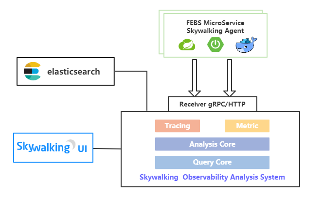

### FEBS Cloud 微服务权限系统


FEBS Cloud是一款使用Spring Cloud Hoxton.RELEASE、Spring Cloud OAuth2 & Spring Cloud Alibaba构建的低耦合权限管理系统，前端（FEBS Cloud Web）采用vue element admin构建。FEBS意指：**F**ast，**E**asy use，**B**eautiful和**S**afe。该系统具有如下特点：

1. 前后端分离架构，客户端和服务端纯Token交互；
 
2. 认证服务器与资源服务器分离，方便接入自己的微服务系统；

3. 微服务防护，客户端请求资源只能通过微服务网关获取；

4. 集成Prometheus，SpringBootAdmin，多维度监控微服务；

5. 集成Spring Cloud Alibaba Nacos服务治理和集中配置管理；

6. 网关限流，网关黑名单限制，网关日志（WebFlux编程实践）；

7. ~~集成Zipkin，方便跟踪Feign调用链~~，集成Skywalking APM；

8. 集成ELK，集中管理日志，便于问题分析；

9. 微服务Docker化，使用Docker Compose一键部署；

10. 支持Kubernetes集群部署；

11. 提供详细的使用文档和搭建教程；

12. 前后端请求参数校验，Excel导入导出，代码生成等。

### 文档与教程

项目导入及使用文档：[https://www.kancloud.cn/mrbird/spring-cloud/1263681](https://www.kancloud.cn/mrbird/spring-cloud/1263681)。

项目从零搭建到部署教程：[https://www.kancloud.cn/mrbird/spring-cloud/1263685](https://www.kancloud.cn/mrbird/spring-cloud/1263685)。

Kubernetes集群部署脚本：[https://github.com/wuyouzhuguli/FEBS-Cloud-K8S](https://github.com/wuyouzhuguli/FEBS-Cloud-K8S)。

分布式事务方案（RocketMQ、TX-LCN、Seata）：[https://www.kancloud.cn/mrbird/spring-cloud/1456142](https://www.kancloud.cn/mrbird/spring-cloud/1456142)。

### 更新日志

[https://www.kancloud.cn/mrbird/spring-cloud/1292659](https://www.kancloud.cn/mrbird/spring-cloud/1292659)

### 系统架构

<table>
  <tr>
    <td align="center" style="background: #fff"><b>FEBS Cloud</b></td>
  </tr>
  <tr>
    <td align="center" style="background: #fff"></td>
  </tr>
  <tr>
  	<td align="center" style="background: #fff"><b>FEBS Prometheus APM</b></td>
  </tr>
  <tr>
  	<td align="center" style="background: #fff"></td>
  </tr>
   <tr>
    <td align="center" style="background: #fff"><b>FEBS Skywalking APM</b></td>
  </tr>
  <tr>
    <td align="center" style="background: #fff"></td>
  </tr>
   <tr>
    <td align="center" style="background: #fff"><b>FEBS Kubernetes</b></td>
  </tr>
  <tr>
    <td align="center" style="background: #fff"></td>
  </tr>
</table>

### 项目地址

 平台  | FEBS Cloud（后端）|FEBS Cloud Web（前端）
---|---|---
GitHub | [https://github.com/wuyouzhuguli/FEBS-Cloud](https://github.com/wuyouzhuguli/FEBS-Cloud)|[https://github.com/wuyouzhuguli/FEBS-Cloud-Web](https://github.com/wuyouzhuguli/FEBS-Cloud-Web)
Gitee  | [https://gitee.com/mrbirdd/FEBS-Cloud](https://gitee.com/mrbirdd/FEBS-Cloud)|[https://gitee.com/mrbirdd/FEBS-Cloud-Web](https://gitee.com/mrbirdd/FEBS-Cloud-Web)

### 演示地址

演示地址：[https://cloud.mrbird.cn](https://cloud.mrbird.cn)

演示环境账号密码：

账号 | 密码| 权限
---|---|---
scott | 1234qwer | 注册账户，拥有查看权限

本地部署账号密码：

账号 | 密码| 权限
---|---|---
mrbird | 1234qwer |超级管理员，拥有所有增删改查权限
scott | 1234qwer | 注册账户，拥有查看，新增权限（新增用户除外）和导出Excel权限
jane | 1234qwer |系统监测员，负责整个系统监控模块

网关管理用户账号密码：

账号 | 密码| 权限
---|---|---
Jack | 123456 |网关管理模块查看权限
admin | 123456 |网关管理模块所有权限

### 服务模块

FEBS模块：

服务名称 | 端口 | 描述
---|---|---
FEBS-Auth| 8101| 微服务认证服务器 
FEBS-Server-System| 8201 | 微服务子系统（资源服务器）
FEBS-Server-Test|8202 | 微服务子系统（资源服务器）
FEBS-Gateway|8301|微服务网关
FEBS-Monitor-Admin|8401|微服务监控子系统

第三方模块：

服务名称 | 端口 | 描述
---|---|---
Nacos| 8001 |注册中心，配置中心 
Zipkin-Server|8402|Zipkin服务器
MySQL| 3306 |MySQL 数据库 
RabbitMQ|5672|RabbitMQ 消息中间件 
Redis| 6379 | K-V 缓存数据库 
Elasticsearch|9200 | 日志存储
Logstash|4560|日志收集
Kibana|5601|日志展示
Prometheus|8403~8409|Prometheus APM
Skywalking|11800、12800、8080|Skywalking APM

### 目录结构
```
├─febs-auth                       ------ 微服务认证服务器
├─febs-cloud                      ------ 整个项目的父模块
│  ├─sql                          ------ SQL脚本
│  ├─config                       ------ 第三方应用配置
│  └─docker compose               ------ 存放docker compose文件
│      ├─elk                      ------ ELK docker compose文件
│      ├─febs-cloud               ------ 聚合所有微服务子项目的docker compose文件
│      ├─prometheus               ------ Prometheus docker compose文件
│      ├─skywalking               ------ Skywalking docker compose文件
│      └─third-part               ------ 第三方服务（MySQL，Redis等）docker compose文件
├─febs-common                     ------ 通用模块
├─febs-gateway                    ------ 微服务网关
├─febs-monitor                    ------ 微服务监控父模块
│  ├─febs-monitor-admin           ------ 微服务监控中心
│  └─zipkin-server                ------ zipkin 服务
└─febs-server                     ------ 资源服务器
   ├─febs-server-system           ------ 资源服务器系统模块
   └─febs-server-test             ------ 资源服务器demo，演示如何整合自己的微服务系统
```
### 系统截图

<table>
  <tr>
     <td></td>
     <td></td>
  </tr>
  <tr>
     <td></td>
     <td></td>
  </tr>
  <tr>
     <td></td>
     <td></td>
  </tr>
  <tr>
     <td></td>
  </tr>
</table>

### 服务APM

#### [Prometheus APM](http://cloud.mrbird.cn:8404)

Grafana账号密码：febs，123456

<table>
  <tr>
     <td width="100%" align="center"><b>JVM监控</b></td>
  </tr>
  <tr>
     <td></td>
  </tr>
  <tr>
  	<td width="100%" align="center"><b>MySQL监控</b></td>
  </tr>
  <tr>
  	<td></td>
  </tr>
   <tr>
     <td width="100%" align="center"><b>Docker容器监控</b></td>
  </tr>
  <tr>
     <td></td>
  </tr>
  <tr>
  	<td width="100%" align="center"><b>Redis监控</b></td>
  </tr>
  <tr>
  	<td></td>
  </tr>
</table>

#### [Skywalking APM](http://123.206.206.203:8080/)

<table>
  <tr>
     <td width="50%" align="top"></td>
     <td width="50%" align="top"></td>
  </tr>
  <tr>
     <td width="50%" align="top"></td>
     <td width="50%" align="top"></td>
  </tr>
</table>


### 参与贡献
欢迎提交PR一起完善项目，以下为提PR并合并的小伙伴（排名不分先后）：

<a href="https://github.com/yuuki80code">
    </a>
<a href="https://github.com/sonake">
    </a>
<a href="https://github.com/mgzu">
    </a>
<a href="https://github.com/liuzhuoming23">
    </a>

### 反馈交流

加入QQ群和大家一起~~交流~~吹水：

